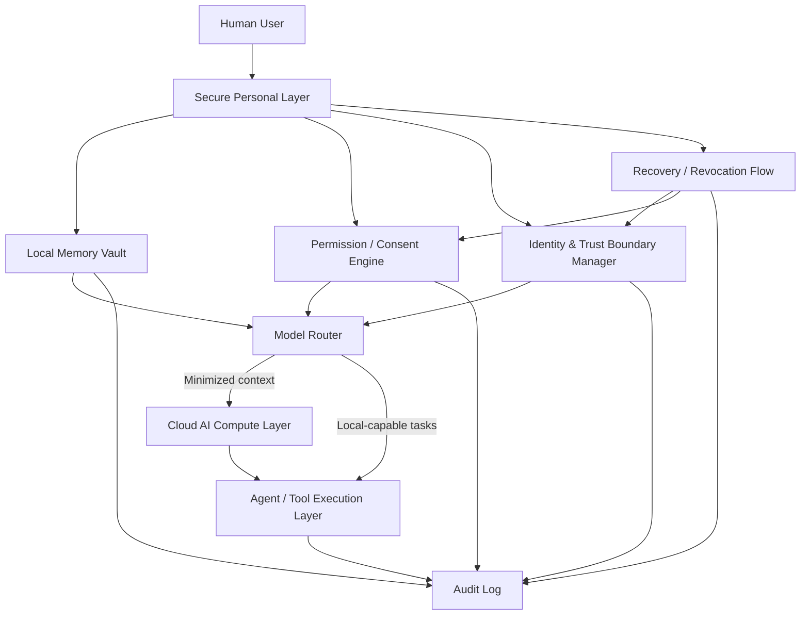

# AI Passport: Conceptual Architecture

This document outlines a practical, high-level architecture for a human-owned personal intelligence layer. It complements the normative commitments in [principles.md](./principles.md), the broader framing in [essay.md](./essay.md), and the risk analysis in [threat-model.md](./threat-model.md).

## Components

### 1) Secure Personal Layer
A user-controlled boundary containing sensitive identity state, policy preferences, and trust anchors. It is the root of authority for personal AI decisions.

### 2) Local Memory Vault
A structured local store for personal context: preferences, recurring goals, stable facts, and selected histories. Designed for inspectability, correction, and deletion.

### 3) Permission / Consent Engine
Evaluates whether specific actions are allowed under explicit consent rules, contextual constraints, and recency conditions.

### 4) Identity and Trust Boundary Manager
Tracks identity assertions, authentication state, delegation scopes, and trust relationships across devices, services, and agents.

### 5) Model Router
Selects among available models (local or cloud) based on capability needs, privacy sensitivity, cost, latency, and policy requirements.

### 6) Cloud AI Compute Layer
Provides interchangeable model inference and advanced reasoning capacity. Receives only the minimum context required for the task.

### 7) Agent / Tool Execution Layer
Runs approved tool calls (calendar, payments, messaging, enterprise systems, etc.) under constrained permissions and auditable policies.

### 8) Audit Log
Maintains tamper-evident local records of critical decisions, permission grants, memory accesses, model routing decisions, and external actions.

### 9) Recovery / Revocation Flow
Defines emergency and routine procedures for loss events, key rotation, consent rollback, identity re-binding, and device transition.

## Mermaid diagram

## Notes

- This is a **conceptual architecture**, not a production blueprint.
- Security properties depend on implementation quality, hardware capabilities, operational discipline, and governance.
- Cloud providers are treated as compute suppliers, not owners of personal identity context.
